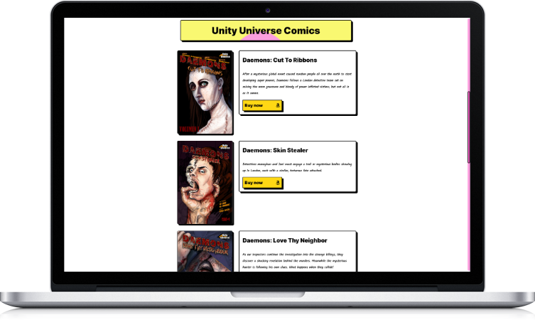

# 

A custom Wordpress theme for the Voice actor/ comedian Kei Gambit


## Table of contents

- [Overview](#overview)
  - [Screenshot](#screenshot)
  - [Links](#links)
  - [Built with](#built-with)
- [Features](#features)
- [Author](#author)

## Overview

### Screenshots


### Links

- See the live site [here](https://keigambit.com)
- Figma design [here](https://www.figma.com/file/aJhMr5g2vI1OFT72YazBz9/Kei-Gambit?node-id=0%3A1)

## Features

### Built with

- 
- 
- 
- 
- [Understrap](https://understrap.com/)

#### Animated Signature


<br>
<br>
First I traced Kei's real signature and made it an SVG. The Signature is broken up into 3 strokes. The stroke-dasharray property sets the length of dashes in an SVG shape. The stroke-dashoffset property controls where the dash of a stroke begins. We can animate the stroke-dashoffset to make it appear like someone is writing the word.
<br>
<br>


```sass
.stroke-1,
.stroke-2,
.stroke-3 {
  fill: none;
  stroke: #000;
  stroke-width: 20;
  stroke-linecap: round;
  stroke-linejoin: round;
  stroke-miterlimit: 10;
  transition: all 0.3s ease;

position: relative;
z-index: 200;
}

.stroke-1 {
stroke-dasharray: 1103;
animation: write1 2s ease-out;
}
.stroke-2 {
stroke-dasharray: 2206;
animation: write2 4s ease-out;
}
.stroke-3 {
stroke-dasharray: 8715;
animation: write3 4s ease-out;
}

@keyframes write1 {
0% {
stroke-dashoffset: 1103;
}
100% {
stroke-dashoffset: 0;
}
}

@keyframes write2 {
0%,
25% {
stroke-dashoffset: 2206;
}
50% {
stroke-dashoffset: 0;
}
}

@keyframes write3 {
0%,
35% {
stroke-dashoffset: 8715;
}
100% {
stroke-dashoffset: 0;
}
}

```

#### How to use custom block patterns

<!--  -->


There are custom block patterns for adding books, comedy events and filmography credits, Simply search for blocks with the keyword 'kei' in the Gutenberg block editor on your WP site. Blocks are created in PHP and have CSS automatically applied to them.

```php

<?php
/**
 * Title: Kei Book
 * Slug: keistheme/kei-book
 * Categories: image
 * Description: A book cover and synopsis for Kei's books
 * Keywords: kei, book, synopsis
 * Block Types: content
 */
?>

<!-- wp:columns -->
<div class="wp-block-columns"><!-- wp:column {"width":"33.33%"} -->
<div class="wp-block-column" style="flex-basis:33.33%"><!-- wp:image {"id":221,"sizeSlug":"large","linkDestination":"none","className":"book-img"} -->
<figure class="wp-block-image size-large book-img"></figure>
<!-- /wp:image --></div>
<!-- /wp:column -->

<!-- wp:column {"width":"66.66%","className":"book-synopsis"} -->
<div class="wp-block-column book-synopsis" style="flex-basis:66.66%"><!-- wp:columns -->
<div class="wp-block-columns"><!-- wp:column -->
<div class="wp-block-column"><!-- wp:heading {"className":"book-header"} -->
<h2 class="book-header">Synopsis</h2>
<!-- /wp:heading --></div>
<!-- /wp:column --></div>
<!-- /wp:columns -->

<!-- wp:paragraph {"className":"book-paragraph"} -->
<p class="book-paragraph">After a mysterious global event caused random people all over the earth to start developing super powers, Daemons follows a London detective team set on solving the more gruesome and bloody of power inflicted victims, but not all is as it seems.</p>
<!-- /wp:paragraph -->

<!-- wp:buttons {"layout":{"type":"flex","verticalAlignment":"top"}} -->
<div class="wp-block-buttons"><!-- wp:button {"className":"btn-buy-now"} -->
<div class="wp-block-button btn-buy-now"><a class="wp-block-button__link" href="https://www.amazon.co.uk/Daemons-Cut-Ribbons-Ari-Abramovsky-ebook/dp/B08HM28TMD">Buy now </a></div>
<!-- /wp:button --></div>
<!-- /wp:buttons --></div>
<!-- /wp:column --></div>
<!-- /wp:columns -->

```

## Author

- Website - [seanred.io](https://seanred.io)
- GitHub - [https://github.com/seanred360](https://github.com/seanred360)
